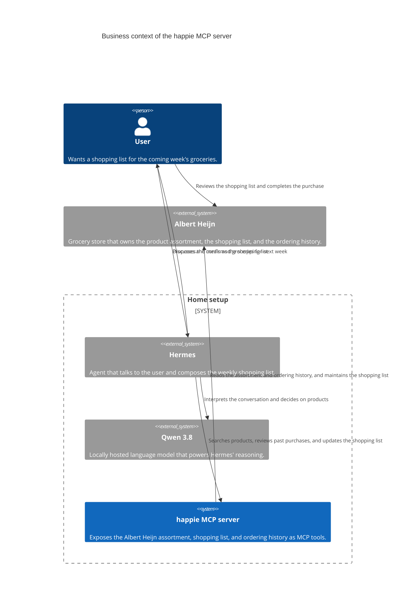

# Context and scope

This section covers the context and scope of the system. The MCP server will
be used by an agent like Hermes to manage the shopping list at Albert Heijn.

## Scope

The happie MCP server is the system under design. It exposes the product
assortment, the shopping list, and the ordering history of Albert Heijn as MCP
tools. It never completes a purchase order; the user remains in control of what
is actually bought.

## Business context

### Domain interfaces

| Partner               | Direction | What is exchanged                                                                                   |
| --------------------- | --------- | --------------------------------------------------------------------------------------------------- |
| User ↔ Hermes         | both      | Meal plans and grocery wishes going in, a proposed shopping list coming back for confirmation.      |
| Hermes → Qwen 3.8     | outgoing  | The conversation and the tool results, so the model can decide which products belong on the list.   |
| Hermes → happie       | outgoing  | Product searches, requests for past purchases, and additions to or removals from the shopping list. |
| happie ↔ Albert Heijn | both      | Product assortment and ordering history coming in, shopping list changes going out.                 |
| User → Albert Heijn   | outgoing  | The final review and the actual purchase, which happens outside this system.                        |

The system deliberately has no interface for placing an order. Completing a
purchase stays a manual step performed by the user at Albert Heijn.
