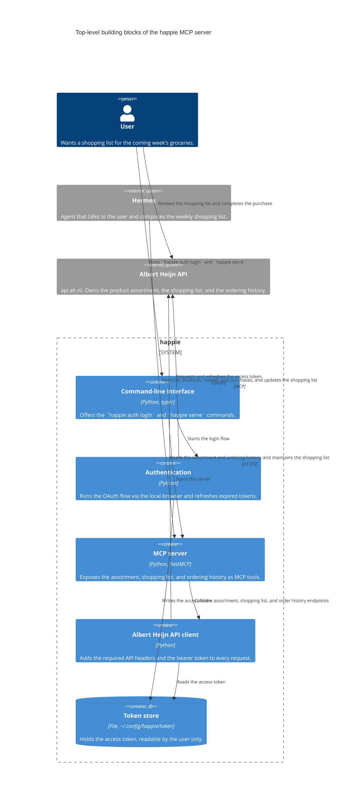
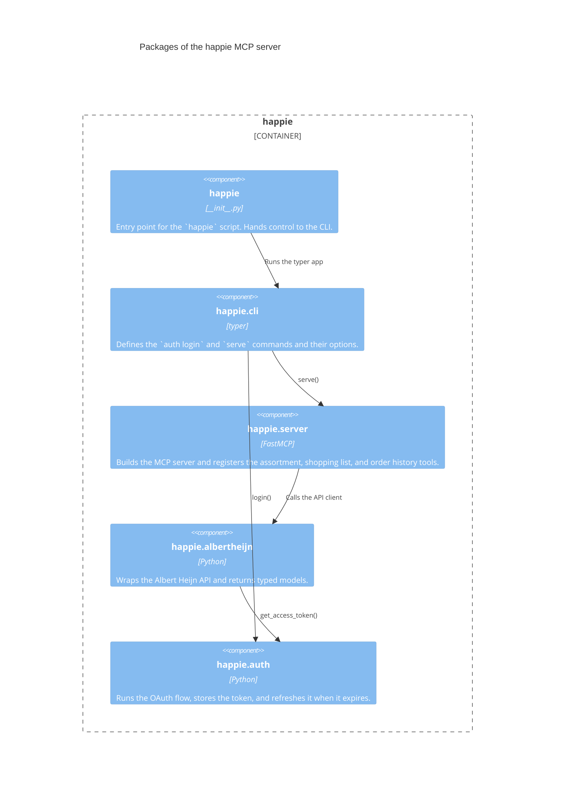

# Building block view

## Context

This is the context diagram from [the context and scope](03-context-and-scope.md)
zoomed in on the happie MCP server. The surrounding actors stay the same, but
the system is now broken down into its top-level building blocks.

| Building block          | Responsibility                                                                                                                 |
| ----------------------- | ------------------------------------------------------------------------------------------------------------------------------ |
| Command-line interface  | Entry point for the user. Wires `happie auth login` to the authentication flow and `happie serve` to the MCP server.           |
| Authentication          | Performs the OAuth flow in the local browser, refreshes expired tokens, and hands the result to the token store.               |
| MCP server              | Exposes the assortment, shopping list, and ordering history as MCP tools. Deliberately offers no tool for placing an order.    |
| Albert Heijn API client | Single point of contact with api.ah.nl. Applies the required headers and the bearer token, and translates responses to models. |
| Token store             | Keeps the access token in `~/.config/happie/token` with user-only permissions.                                                 |

The MCP server keeps running when the token is missing or cannot be refreshed;
it logs the problem so the user can obtain a new token from the command line.

## Application module structure

Every building block from the previous section maps onto exactly one package
under `src/happie`. Each package is a deep module: it keeps its HTTP calls,
parsing, and file handling internal and exposes a handful of names through its
`__init__.py`.

| Package              | Public interface                              | Contains                                                                                |
| -------------------- | --------------------------------------------- | --------------------------------------------------------------------------------------- |
| `happie`             | `main()`                                      | The console script declared in `pyproject.toml`. Nothing else.                           |
| `happie.cli`         | `app`                                         | The typer application and the command definitions.                                       |
| `happie.server`      | `serve()`                                     | The FastMCP instance and the tool functions, one module per group of tools.              |
| `happie.albertheijn` | `AlbertHeijnClient` and the models it returns | The required API headers, the endpoint calls, and the response models.                   |
| `happie.auth`        | `login()`, `get_access_token()`               | The OAuth flow, the browser redirect handler, and the token file in `~/.config/happie`.  |

Dependencies point in one direction only: `happie` → `happie.cli` →
`happie.server` → `happie.albertheijn` → `happie.auth`. The CLI also calls
`happie.auth` directly for the login command. No package imports a package that
sits above it, so there are no import cycles.

Tests live in `tests/` and mirror this structure, with one module per package,
so a failing test points at a single building block.
